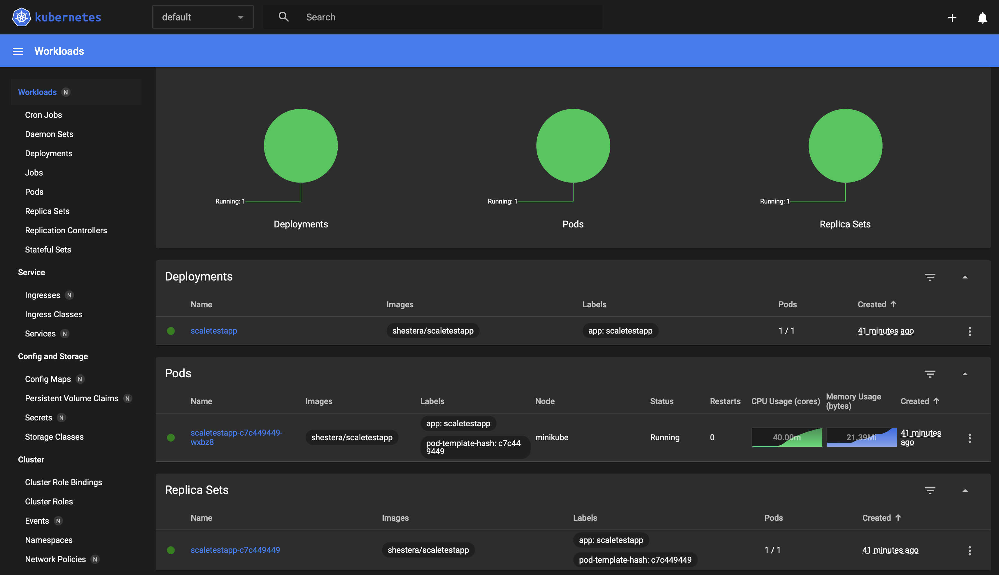
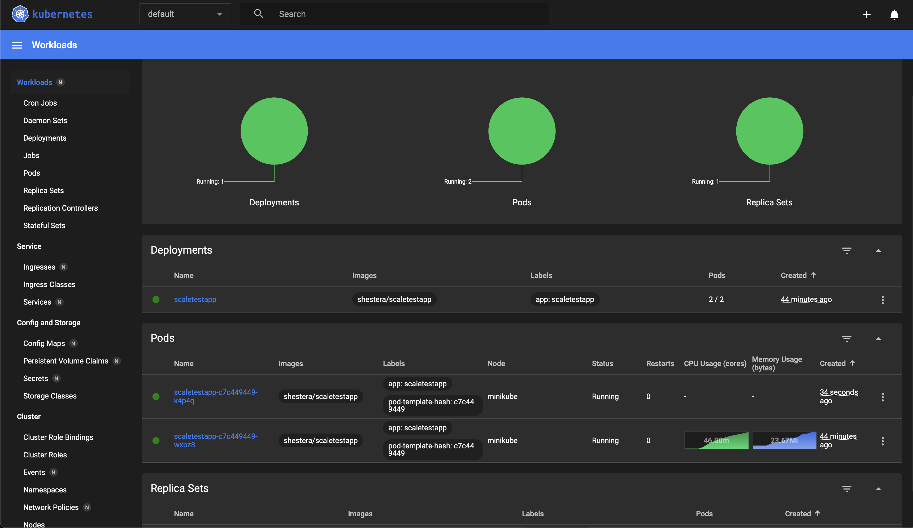

# Задание 1. Проектирование технологической архитектуры для InsureTech

## 1. Стратегия масштабирования и отказоустойчивости
Для обеспечения высокой доступности и отказоустойчивости системы при растущем числе пользователей предлагается использовать **независимые кластеры Kubernetes в нескольких зонах доступности**. Такое решение позволяет:

- Развернуть кластеры в разных регионах РФ, что обеспечит одинаковое время отклика для пользователей вне зависимости от их местоположения.
- Минимизировать риски полного отключения сервиса в случае отказа одного дата-центра.
- Соответствовать требованиям по доступности 99,9%, RTO (45 мин) и RPO (15 мин).

Масштабирование:
- **Горизонтальное масштабирование**: Добавление новых нод в кластеры по мере роста нагрузки.
- **Вертикальное масштабирование**: Используется для базы данных, чтобы обеспечить высокую производительность при обработке сложных запросов.

Почему независимые кластеры:
- Независимые кластеры в каждой зоне доступности позволяют минимизировать риски межрегиональных задержек и обеспечивают лучшую локальную производительность.

## 2. Конфигурация развёртывания в Kubernetes
Каждый региональный кластер Kubernetes включает:
- **Поды с основными приложениями (core-app, client-info, ins-product-aggregator и ins-comp-settlement)**.
- **Внутренние балансировщики нагрузки для распределения трафика между подами**.
- **Независимые namespace для каждого сервиса**.

Конфигурация:
- В каждой зоне доступности развёрнут независимый кластер Kubernetes.
- Поддерживается резервирование подов и автоматическое масштабирование с помощью Horizontal Pod Autoscaler (HPA).

Преимущества независимых кластеров:
- Упрощённая изоляция проблем.
- Повышенная отказоустойчивость.

## 3. Балансировка нагрузки
Используется **глобальный балансировщик нагрузки на основе Geo-DNS** и **региональные балансировщики нагрузки**.

Подход:
- **Глобальный балансировщик** распределяет пользователей по ближайшим к ним регионам.
- В случае отказа одного региона трафик автоматически перенаправляется в резервный регион.
- **Региональные балансировщики** распределяют трафик между подами внутри кластера.

Health check:
- Регулярные проверки состояния подов и баз данных.
- При выявлении проблемы глобальный балансировщик исключает проблемную зону из маршрутизации.

## 4. Фейловер-стратегия
Фейловер обеспечивается за счёт:
- **Глобального балансировщика**: Если один из регионов становится недоступен, трафик перенаправляется в другой регион.
- **Репликации базы данных**: Используется синхронная репликация между основным и резервным экземпляром PostgreSQL.

Почему Geo-DNS:
- Обеспечивает минимальную задержку для пользователей из разных регионов.
- Позволяет быстро переключаться между зонами доступности.

## 5. Конфигурация базы данных
Конфигурация базы данных:
- Основной экземпляр PostgreSQL (Master) развёрнут в одной зоне доступности.
- Реплика PostgreSQL (Replica) развёрнута в другой зоне доступности.

Репликация и резервное копирование:
- Используется **синхронная репликация** для обеспечения RPO = 15 минут.
- Периодические **снапшоты и бэкапы** для восстановления данных.

Шардирование:
- Пока не требуется. Объём данных составляет всего 50 GB, что может быть эффективно обработано одним экземпляром PostgreSQL.
- В будущем можно внедрить шардирование по клиентам для дальнейшего масштабирования.

## Итоговое решение
### Основные элементы схемы:
1. Независимые кластеры Kubernetes в двух регионах.
2. Глобальный балансировщик нагрузки (Geo-DNS).
3. Региональные балансировщики нагрузки.
4. Основной и резервный экземпляры PostgreSQL с синхронной репликацией.
5. Автоматическое масштабирование подов и резервирование.

Данное решение обеспечивает:
- Высокую отказоустойчивость.
- Минимальное время отклика для пользователей из всех регионов.
- Соответствие требованиям RTO и RPO.
- Поддержание доступности на уровне 99,9%.

["Диаграмма технологической архитектуры"](./Exc1/InsureTech_технологическая_архитектура_to-be.drawio.xml)

# Задание №2: Динамическое масштабирование контейнеров

В рамках задания настроено динамическое масштабирование контейнеров с использованием Horizontal Pod Autoscaler (HPA). HPA автоматически регулирует количество реплик приложения в зависимости от утилизации оперативной памяти, что позволяет обеспечивать стабильную работу приложения при изменениях нагрузки и оптимально использовать ресурсы.

Основные шаги:

1. Поднят локальный кластер Kubernetes с помощью Minikube.

2. Активирован компонент metrics-server для сбора метрик.

3. Разработан и применён манифест Deployment для тестового приложения с лимитом памяти.

4. Создан и настроен Service для доступа к приложению внутри кластера.

5. Настроен Horizontal Pod Autoscaler для масштабирования приложения при утилизации памяти выше 80%.

6. Выполнено тестирование нагрузки на приложение с помощью Locust.






# Задание 3. Анализ текущей архитектуры InsureTech

## Проблемы и риски, связанные с планируемым ростом нагрузки

### Проблемы:
1. **Синхронные вызовы между сервисами через REST API**
   - Сервисы `core-app` и `ins-comp-settlement` зависят от времени отклика сервиса `ins-product-aggregator`, который, в свою очередь, запрашивает данные у страховых компаний.
   - Увеличение числа интеграций с новыми страховыми компаниями приведёт к увеличению времени обработки запросов и возможным ошибкам.

2. **Редкая синхронизация данных**
   - `core-app` запрашивает данные у `ins-product-aggregator` раз в 15 минут, а `ins-comp-settlement` — раз в сутки. Это приводит к тому, что данные о продуктах и тарифах могут устареть.
   - `ins-comp-settlement` также запрашивает данные о оформленных страховках у `core-app` через REST API раз в сутки, что создаёт узкое место в процессе расчётов.

3. **Ошибки взаимодействия с внешними API**
   - Ошибки в API страховых компаний могут вызвать сбои в работе сервиса `ins-product-aggregator`, что повлияет на все сервисы, зависящие от него.

### Риски:
1. **Снижение производительности**
   - Увеличение числа интеграций с новыми страховыми компаниями увеличит нагрузку на `ins-product-aggregator`, что может привести к снижению производительности.

2. **Рост вероятности ошибок и задержек**
   - Чем больше внешних API обрабатывает `ins-product-aggregator`, тем выше вероятность ошибок и задержек.

3. **Недостаточная масштабируемость**
   - Текущая архитектура не приспособлена для обработки большого объёма асинхронных событий, что ограничивает её масштабируемость.

### Вывод:
Текущая архитектура требует перехода на **Event-Driven архитектуру**, чтобы устранить проблемы синхронных вызовов и обеспечить актуальность данных в режиме реального времени. Использование **Event-Streaming** (например, Kafka) и паттерна **Transactional Outbox** позволит повысить отказоустойчивость и масштабируемость системы.


["Обновленная диаграмма контейнеров"](./Exc3/InsureTech_C4_сontainer-diagram.drawio.xml)


# Задание 4. Добавление сервиса ОСАГО

## **Требуется ли osago-aggregator своё хранилище данных?**

Да, **osago-aggregator** должен иметь своё хранилище данных. Основные причины:

1. **Управление заявками**: Osago-aggregator должен хранить состояние заявок на всех этапах — от отправки до получения предложений от страховых компаний.
2. **Повторные опросы**: Хранилище позволит сохранять идентификаторы заявок, чтобы повторно опрашивать API страховых компаний без необходимости держать всё в оперативной памяти.
3. **Обработка ошибок и ретраев**: В случае временных ошибок или задержек сервис сможет повторно отправить запросы к страховым компаниям на основании данных из хранилища.

## **Какой API osago-aggregator предоставляет core-app?**

Osago-aggregator должен предоставлять **асинхронное API** для взаимодействия с core-app.

### Предлагаемые эндпоинты:
1. **POST /osago/request** — создание новой заявки на ОСАГО.
   - **Входные данные**: информация о клиенте и автомобиле.
   - **Выходные данные**: `request_id`.

2. **GET /osago/response/{request_id}** — получение результатов по заявке.
   - **Выходные данные**: список предложений от страховых компаний.

## **Средство интеграции между core-app и osago-aggregator**

Можно использовать имеющийся **Event Bus** (Kafka) для передачи событий между core-app и osago-aggregator.
Event Bus позволяет эффективно обрабатывать асинхронные события, не блокируя выполнение основного потока.

**Поток обработки:**
1. Core-app публикует событие `Создана заявка на ОСАГО`.
2. Osago-aggregator обрабатывает событие, отправляет запросы в страховые компании и публикует событие `Ответ по заявке ОСАГО получен`.
3. Core-app подписывается на событие и обновляет интерфейс пользователя.


## **Средство интеграции между веб-приложением и core-app**

Интеграция между веб-приложением и core-app остаётся **REST**. Однако для улучшения пользовательского опыта стоит использовать **WebSocket** для отображения поступающих предложений в реальном времени. WebSocket позволяет отправлять данные клиенту сразу после их получения, что соответствует требованию отображать предложения от страховых компаний по мере их поступления.

## **Применение паттернов отказоустойчивости**
Timeout — установка максимального времени ожидания ответа от страховой компании (не более 60 секунд).

### Обновлённая диаграмма взаимодействия сервисов:
["Обновленная диаграмма с ОСАГО"](./Exc4/InsureTech_C4_сontainer-diagramOSAGO.drawio.xml)


# Задание 5. Проектирование GraphQL API

### **Анализ текущего REST API сервиса client-info (Swagger контракт)**

Из анализа REST API видно, что для получения данных о клиенте сервис предоставляет несколько эндпоинтов:

1. **GET /clients/{id}** — получение основной информации о клиенте.
   - Возвращает данные сущности `Client` с полями `id`, `name`, `age`.

2. **GET /clients/{id}/documents** — получение списка документов клиента.
   - Возвращает массив сущностей `Document` с полями `id`, `type`, `number`, `issueDate`, `expiryDate`.

3. **GET /clients/{id}/relatives** — получение информации о родственниках клиента.
   - Возвращает массив сущностей `Relative` с полями `id`, `relationType`, `name`, `age`.

### **Разработка схемы GraphQL API**

####  **Типы данных (Entities):**

```graphql
type Client {
  id: String!
  name: String
  age: Int
  documents: [Document]
  relatives: [Relative]
}

type Document {
  id: String!
  type: String
  number: String
  issueDate: String
  expiryDate: String
}

type Relative {
  id: String!
  relationType: String
  name: String
  age: Int
}
```

#### **Запросы (Queries):**

```graphql
type Query {
  getClient(id: String!): Client
  getDocuments(clientId: String!): [Document]
  getRelatives(clientId: String!): [Relative]
}
```

###  **Описание сущностей и запросов:**

1. **Client** — основной объект, который содержит информацию о клиенте, его документах и родственниках.
   - Поля: `id`, `name`, `age`, `documents`, `relatives`.

2. **Document** — объект, представляющий документ клиента.
   - Поля: `id`, `type`, `number`, `issueDate`, `expiryDate`.

3. **Relative** — объект, представляющий родственника клиента.
   - Поля: `id`, `relationType`, `name`, `age`.


["Схема GraphQL"](./Exc5/Schema.graphql)


# Задание 6. Настройка Rate Limiting

1. Директива ```limit_req_zone``` определяет зону памяти, где Nginx будет хранить информацию о лимитах для каждого клиента. Директива ```limit_req``` используется внутри location для применения ранее объявленной зоны лимитов к конкретным запросам.

2. ```error_page 429 /429.html;``` — указывает Nginx, что нужно перенаправлять клиентов на специальную страницу, если они получают ошибку 429, а ```location = /429.html { return 429 "Too Many Requests. Please try again later."; }``` — задаёт сообщение для ошибки 429.

["Конфигурационный файл nginx"](./Exc6/rate_limit.conf)
